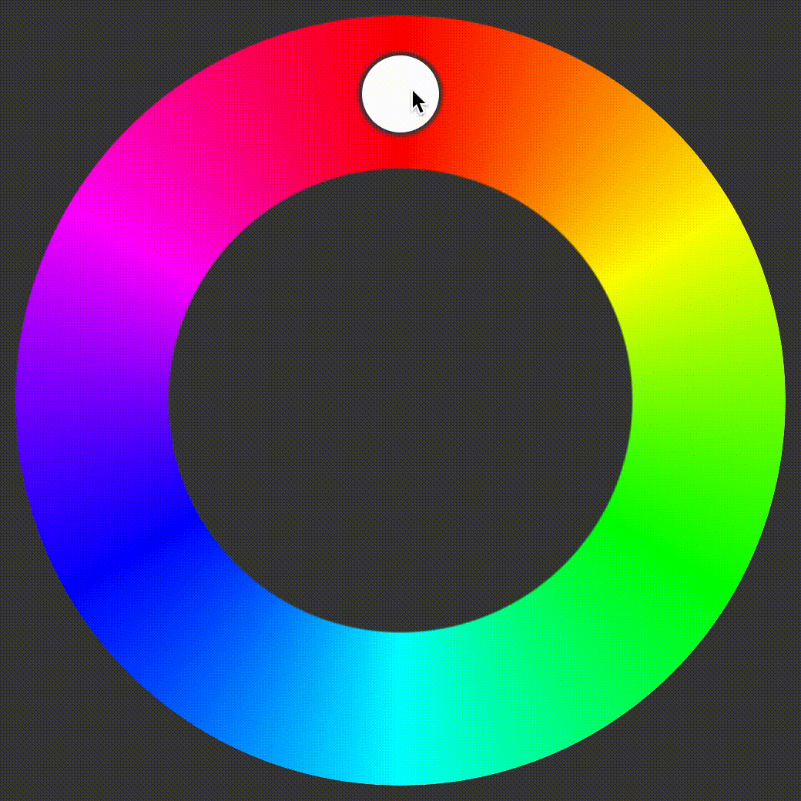

# JavaScript Circular Color Picker
----
## About
Simple circular color picker in JavaScript with scroll and touchscreen support.

`type="simple"` | `type="complex"`
-|-
 | 

## Requirements
* ** None **

## Usage
1. simply add
```
<div class="colorpicker" type="simple"></div>
```
or
```
<div class="colorpicker" type="complex"></div>
```
to your HTML code
2. Set the size with a bit of CSS
3. Put all resources into the resources folder
4. Add ``` <script src="./resources/colorpicker.js"></script> ``` to the bottom of the page
5. Add an EventListener to the colorpicker element and listen for the 'colorchange' event. The color values are stored in `event.detail.color`.
6. You're done!

## Author
**Sebastian Faul** - [sebastian@faul.info](mailto:sebastian@faul.info)
